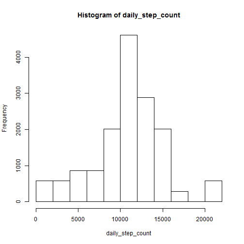
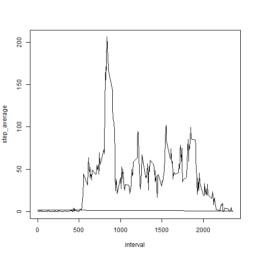
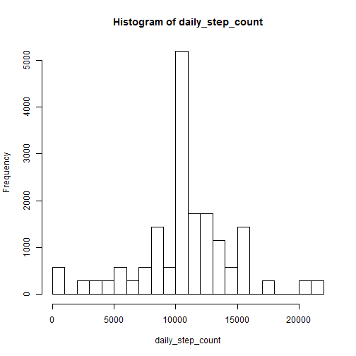
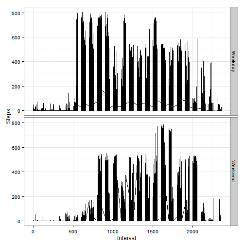

This is an R Markdown document. Markdown is a simple formatting syntax for authoring HTML, PDF, and MS Word documents. For more details on using R Markdown see <http://rmarkdown.rstudio.com>.

When you click the **Knit** button a document will be generated that includes both content as well as the output of any embedded R code chunks within the document. You can embed an R code chunk like this:

Libraries "dplyr" and "ggplot2" have been used for this assignment. They were included in the R program as follows:


```r
#---Reading the libraries----
library(dplyr)
library(ggplot2)
```

## Loading and preprocessing the data

Data file was located in the current working directory for R. Data was read as a csv file as below:

```r
#----Reading the data----
data<-read.table("activity.csv",header=TRUE,sep=',')
```

## Calculating the mean total number of steps taken per day

For this part of the assignment, NA values have been ignored. Therefore data was filtered to remove NA values.


```r
#Removing the NA values in steps
data_valid<-filter(data,!is.na(data$steps))
```

**Total number of steps taken per day**

To calculate the total number of steps taken per day *group_by* function from dplyr package was used to group the data using the column data and calculate the sum of steps for each date. Mutate function creates the column *daily_step_count* which is filled with the same daily sum value for each row corresponding to the same date.


```r
#calculating total number of steps each day
step_sum_byDay<-data_valid%>%
    group_by(date)%>%
    mutate(daily_step_count=sum(steps))
```

**Histogram of the total number of steps taken each day**

Histogram was plotted using the base plotting system in R.


```r
#plotting the histogram
with(step_sum_byDay,hist(daily_step_count))
```

 

**Calculating the mean and median of total number of steps taken per day**

For calculating the mean and median we take the daily sum value for each day and use *mean* and *median* function to perform the computation. Only interval 0 is read for each day because the daily sum value is the same for each row corresponding to the same date.


```r
for_mean_median<-step_sum_byDay%>%
  filter(interval==0)
mean_steps<-mean(for_mean_median$daily_step_count)
median_steps<-median(for_mean_median$daily_step_count)
```
The calculated value of mean of daily step count is 1.0766189 &times; 10<sup>4</sup> and median of daily step count is 10765.

## Average daily activity pattern

**Time series plot** 

Dplyr package is again used to compute the average number of steps taken per interval average across all days as followS:


```r
#average daily activity time series plot
data_valid2<-data_valid%>%
  group_by(interval)%>%
  mutate(step_average=mean(steps))
```
Time series plot is made using the base plotting system in R.

```r
with(data_valid2, plot(interval,step_average,type="l"))
```

 

**Time interval with maximum number of steps across all days**
Interval with maximum steps is calculating by looking at the corresponding average daily step count maximum.

```r
#5-minute interval with max activity
max_steps<-max(data_valid2$step_average)
max_interval<-filter(data_valid2,step_average==max_steps)
max_interval<-unique(max_interval$interval)
```
The interval found to have maximum daily step count is 835.

## Inputing missing values

**Calculating and reporting missing values**

IS.NA function is used to calculated and report the missing values.

```r
#Inputing missing values
data_na<-filter(data,is.na(data$steps))
missing_no=nrow(data_na)
```
Total number of missing values is found to be 2304.

**Filling in the missing values in the dataset**

Missing values have been replaced by the average daily value for that time interval.

```r
#create a data frame with just the interval and average steps
data_average<-data_valid2[1:288,4]
data_average<-do.call("rbind",replicate(61,data_average,simplify = FALSE))
#merge average data column with the data
data<-cbind(data,data_average$step_average)
colnames(data)<-c("Steps","Date","Interval","AvgSteps")
data$Steps[is.na(data$Steps)]<-data$AvgSteps[is.na(data$Steps)]
```

**Creating a histogram with new data set without missing values**


```r
step_sum_byDay2<-data%>%
  group_by(Date)%>%
  mutate(daily_step_count=sum(Steps))
#plotting the histogram
with(step_sum_byDay2,hist(daily_step_count))
```

 
Similar process as used earlier is used to plot new histogram and to calculate the new mean and median values.

```r
for_mean_median2<-step_sum_byDay2%>%
  filter(Interval==0)
mean_steps2<-mean(for_mean_median2$daily_step_count)
median_steps2<-median(for_mean_median2$daily_step_count)
```
New mean value is 1.0766189 &times; 10<sup>4</sup> and the median value is 1.0766189 &times; 10<sup>4</sup>.
As we replace the missing values with mean value, the mean of new data set remains unchanged. However, median is now equal to the mean value.

## Differences in weekend and weekday activity pattern.

**Adding weekday and weekend information in the data**

Function weekdays is used to extract and add the weekend and weekday information to the data.

```r
#Weekday Weekend Analysis
data$Date<-as.Date(data$Date)
data<-mutate(data,Day=factor(weekdays(data$Date,abbreviate = TRUE)))
Weekday<-filter(data,as.character(Day)=="Mon"|as.character(Day)=="Tue"|as.character(Day)=="Wed"|as.character(Day)=="Thu"|as.character(Day)=="Fri")
Weekday<-mutate(Weekday,Day="Weekday")
Weekend<-filter(data,as.character(Day)=="Sat"|as.character(Day)=="Sun")
Weekend<-mutate(Weekend,Day="Weekend")
data<-rbind(Weekend,Weekday)
data$Day<-as.factor(data$Day)
```

**Panel plot containing time series plot for weekend and weekdays**
ggplot2 package is used to create the panel plot.

```r
ggplot(data = data,aes(Interval,Steps))+geom_line()+facet_grid(Day ~.)+theme_bw()
```

 

